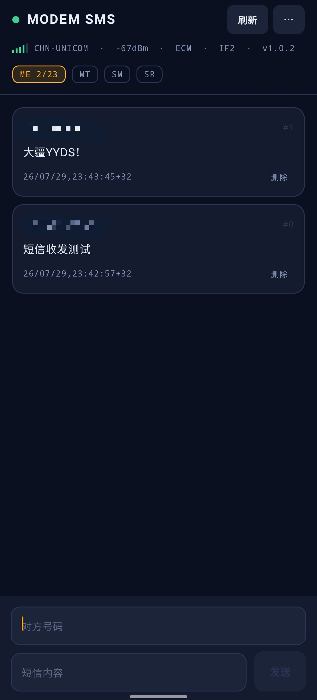
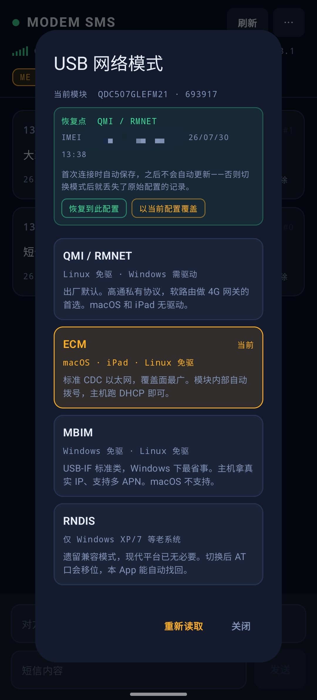
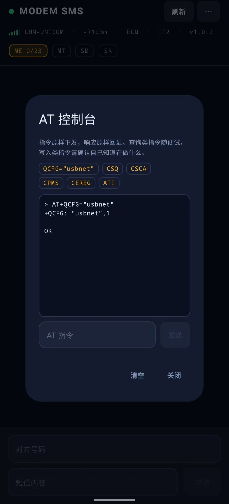

# Modem SMS

安卓端通过 USB OTG 直接收发 4G 模块短信，**不需要 root，不需要内核驱动**。

把一块 LTE 模块插到手机上，它就变成一个独立的短信收发终端——SIM 卡不占手机卡槽，
验证码直接在 App 里看，还能一键复制。

> 为兼容 DJI 增强图传模块（内核为 Quectel EG25-G）而写，同样适用于其他移远/高通平台模组。
> 本项目与 DJI、Quectel 均无任何关联，未获得也未寻求其授权或背书。

<table>
<tr>
<td width="33%" align="center">
<br>
<sub><b>主界面</b><br>验证码自动提取，点击复制</sub>
</td>
<td width="33%" align="center">
<br>
<sub><b>USB 模式</b><br>当前模式高亮，高风险项标注</sub>
</td>
<td width="33%" align="center">
<br>
<sub><b>AT 控制台</b><br>指令原样下发，响应原样回显</sub>
</td>
</tr>
</table>

---

## 为什么不需要驱动

短信要走模块的 AT 命令口，而那几个接口是**厂商自定义类（`Cls=ff`）**，
不是标准 CDC-ACM。常规做法是靠内核的 `option` 驱动生成 `/dev/ttyUSB*`，
但手机 ROM 基本都没编译这个驱动，而且 `/dev/ttyUSB*` 权限是 `root:root`，
普通 App 读不到。

本项目改走 Android 的 **USB Host API**：App 直接 claim 接口做 bulk 读写，
完全绕开内核串口层。所以既不用 root，也不用刷内核。

---

## 功能

**短信收发**
- 读取模块存储区里的全部短信，中文自动 UCS2 解码
- 发送时按内容自动选编码：纯 ASCII 走 GSM（160 字符），含中文切 UCS2（70 字符）
- 新短信到达自动刷新（`+CMTI` 上报）

**验证码提取**
- 识别验证码类短信，单独显示大号数字，点击复制

**存储区管理**
- 实时显示 `ME` / `SM` / `MT` 各区占用，一键切换
- 存满时高亮告警（模块存满后新短信会被**丢弃**而非覆盖）
- 单条删除、按已读批量删除、清空

**USB 网络模式切换**
- 直接读写 `AT+QCFG="usbnet"`，不用再接电脑跑 Linux

| 值 | 模式 | 能用的主机 |
|---|---|---|
| 0 | QMI / RMNET | Linux、Windows（需装移远驱动） |
| 1 | ECM | macOS、iPadOS、Linux |
| 2 | MBIM | Windows、Linux |
| 3 | RNDIS | Windows、Android、HarmonyOS |

**AT 控制台**
- 直接下发任意 AT 指令，原样回显响应
- 内置常用查询快捷键（`QCFG="usbnet"`、`CSQ`、`CSCA?`、`CPMS?`、`CEREG?`、`ATI`）
- 排查固件差异时不用再接电脑

**链路诊断**
- 顶部常驻遥测行：信号格、运营商、dBm、当前 USB 模式、AT 口接口号、应用版本
- 未注册到网络或短信中心号码为空时整行变红——发送失败的两大主因，一眼可见

---

## 安全设计

**AT 口自动探测。** 切换 `usbnet` 会改变 USB 接口布局，AT 口位置会变。
写死接口号会导致切换后再也连不上，而手机上没有 `new_id` 那种救场手段。
本项目逐个接口发 `AT`，谁回 `OK` 就用谁。

**写入后读回校验。** 部分定制固件对 `AT+QCFG` 返回 `OK` 但并不真正写入 NV。
切换模式后会立即读回比对，不一致就明确报错，不会让你误以为成功。

**RNDIS 单独警告。** 已知部分固件切到 RNDIS 后 AT 串口消失，
届时 App 无法再切回，只能接电脑用 Linux 恢复。切换前有明确提示。
ECM / MBIM / QMI 均保留串口，可随意切换。

---

## 硬件要求

- 支持 USB OTG 的 Android 8.0+ 设备
- Quectel EG25-G 或兼容的移远 LTE 模组
- **带外部供电的 OTG 转接头（必需，不是可选项）**

模块发射瞬时电流可达 1.5 A 以上，而手机 OTG 通常只提供 500 mA。
直插的典型表现是能识别、发几条指令后掉线，很容易误判成软件问题。
必须用带 PD 供电直通的转接头，让模块吃外部电源。

---

## 编译

### GitHub Actions

推送到仓库即自动构建，在 Actions 页面的 Artifacts 下载 APK。
工作流见 [`.github/workflows/build.yml`](.github/workflows/build.yml)。

### 本地

```bash
gradle assembleDebug        # 调试包
gradle assembleRelease      # 正式包
```

产物在 `app/build/outputs/apk/`。环境：JDK 17、Android SDK 35、Gradle 8.9+。

### 正式签名（可选）

不配签名密钥也能编出 release 包，会退回调试证书——可以安装，但**每次构建
签名都不同，无法覆盖升级**。要正式分发就生成一个自己的密钥：

```bash
keytool -genkeypair -v \
  -keystore release.jks -alias release \
  -keyalg RSA -keysize 2048 -validity 10000
```

本地构建：在项目根目录建 `keystore.properties`（已在 .gitignore 中）：

```properties
storeFile=/absolute/path/to/release.jks
storePassword=...
keyAlias=release
keyPassword=...
```

CI 构建：把密钥转成 base64 存进仓库 Secrets：

```bash
base64 -i release.jks | pbcopy      # Linux 用 base64 -w0 release.jks
```

在 Settings → Secrets and variables → Actions 添加四项：
`KEYSTORE_BASE64`、`KEYSTORE_PASSWORD`、`KEY_ALIAS`、`KEY_PASSWORD`。

**密钥文件和密码务必自己备份。** 丢了就无法为已发布的应用推送升级，
只能换包名重来。

### 发布

打 tag 即自动构建并创建 GitHub Release：

```bash
git tag v1.0.0
git push origin v1.0.0
```

版本号取自 tag（去掉前缀 `v`），versionCode 用 CI 运行序号。

---

## 适配其他模块

`Modem.kt` 顶部的常量按需修改：

```kotlin
const val VENDOR_ID = 0x2CA3          // 移远标准 ID 为 0x2C7C
const val PRODUCT_ID = 0x4006         // 对应 0x0125
const val AT_INTERFACE_HINT = 2       // 优先尝试的接口号，探测失败会自动遍历
```

同时更新 [`res/xml/device_filter.xml`](app/src/main/res/xml/device_filter.xml)，
注意其中的 vendor-id / product-id **必须写十进制**。改了才会在插入时自动弹出打开提示；
不改也能用，手动点连接即可。

---

## 已知限制

- **退到后台收不到新短信推送。** Android 会挂起进程，USB 读取线程停止。
  重新打开时靠 `AT+CMGL` 重新拉取。需要常驻得加前台服务。
- **短信只存在模块里**，拔掉模块就看不到历史。本地归档未实现。
- **长短信不分片。** 超过单条上限会被截断；接收的长短信在文本模式下会拆成多条。
  正确处理需要转 PDU 模式解析 UDH。
- 部分固件不支持批量删除的 `AT+CMGD=1,<flag>` 写法。
- 模块存储满后新短信被丢弃而非覆盖，需定期清理。

欢迎 PR。

---

## 排查

发送失败先确认这几项，在电脑上用 `socat` 或本 App 的遥测行都能看：

```
AT+CSCA?     短信中心号码，为空则发不出去
AT+CEREG?    第二个数为 1 或 5 才算注册上网络
AT+CPIN?     应返回 READY
AT+CPMS?     各存储区占用
```

App 显示「没找到模块」时，先排除供电问题再怀疑代码。

---

## 免责声明

本项目仅供学习和个人使用。使用者需自行确保：

- 对所操作的硬件拥有合法处置权
- SIM 卡的使用符合运营商条款及所在地法律法规
- 不将本工具用于批量接码、代收验证码或任何违法用途

修改模块 NV 配置存在使设备无法正常工作的风险，**操作前请备份原始配置**
（`AT+QCFG="usbnet"` 读取当前值并记录）。作者不对任何硬件损坏、数据丢失或
法律后果承担责任。

## 许可

[MIT](LICENSE)
